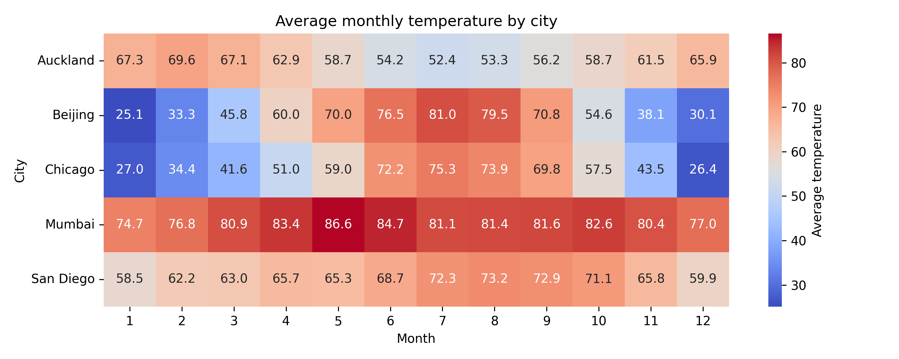
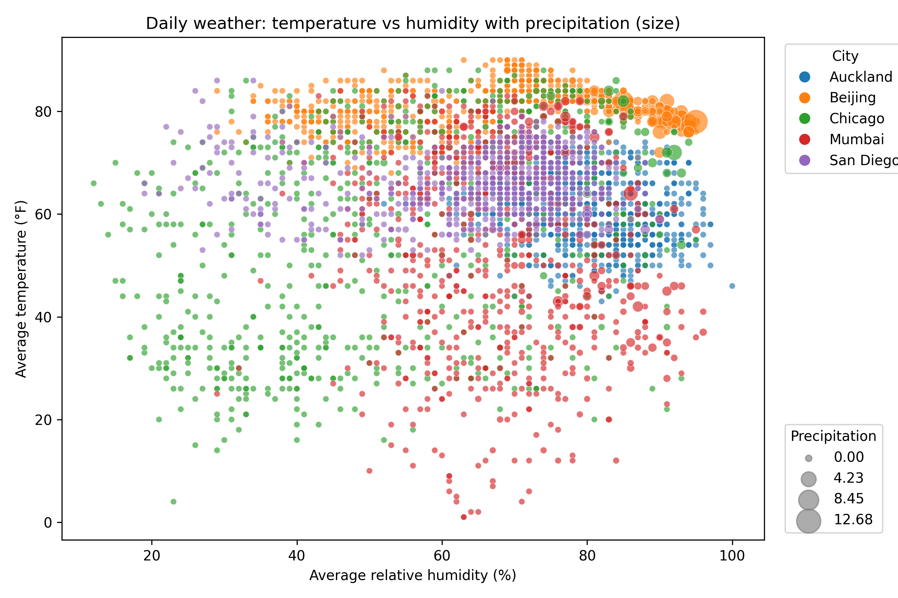
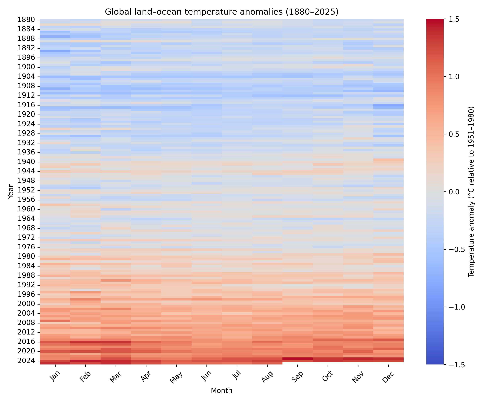
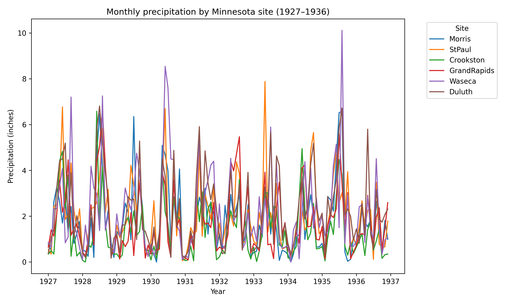

# Bài tập lớn môn quản trị dữ liệu và trực quan hóa
# Họ và tên: Nguyễn Hòa Khiêm
# MSSV: 20252031M

---

## 1. Giới thiệu

Bài lab xây dựng một **pipeline trực quan hóa dữ liệu khí hậu – thủy văn** hoàn chỉnh
bằng Python. Script [src/create_visualizations.py](src/create_visualizations.py)
đọc 3 bộ dữ liệu thật từ thư mục `data/`, làm sạch, biến đổi và sinh ra **4 biểu đồ**
lưu vào thư mục `output/`.

### Bộ dữ liệu sử dụng

| File | Nội dung | Thời gian | Nguồn |
|------|----------|-----------|-------|
| `weather_data.csv` | Quan trắc thời tiết ngày cho nhiều thành phố (nhiệt độ, độ ẩm, gió, áp suất, lượng mưa) | 2016–2017 | mosaicData (Rdatasets) |
| `global_temp.csv` | Dị thường nhiệt độ đất–biển toàn cầu (so với baseline 1951–1980) | 1880–2025 | NASA GISS (GISTEMP) |
| `minnesota_weather.csv` | Tổng hợp thời tiết tháng cho 6 trạm nông nghiệp Minnesota | 1927–1936 | agridat (Rdatasets) |

---

## 2. Script đã làm gì

| Hàm | Đầu vào | Loại biểu đồ | File output |
|-----|---------|--------------|-------------|
| `plot_weather_heatmap` | `weather_data.csv` | Heatmap nhiệt độ TB theo thành phố × tháng | `weather_heatmap.png` |
| `plot_weather_scatter` | `weather_data.csv` | Scatter 4 chiều (độ ẩm, nhiệt độ, lượng mưa, thành phố) | `weather_scatter.png` |
| `plot_global_temp_heatmap` | `global_temp.csv` | Heatmap dị thường nhiệt độ năm × tháng | `global_temp_heatmap.png` |
| `plot_minnesota_precip_line` | `minnesota_weather.csv` | Line chart lượng mưa theo 6 trạm × thời gian | `minnesota_precip_line.png` |

Hàm `main()` điều phối toàn bộ: tạo thư mục output, nạp từng CSV, làm sạch dữ liệu,
gọi 4 hàm vẽ và in danh sách đường dẫn ảnh đã tạo.

## 3. Phân tích kết quả & các chỉ số đáng chú ý

### 3.1. `weather_heatmap.png` — Nhiệt độ TB theo thành phố × tháng

- **Mumbai là điểm nóng tuyệt đối**: dao động hẹp **74.7–86.6°F** quanh năm, đỉnh
  **86.6** vào tháng 5 → khí hậu nhiệt đới, gần như không có mùa lạnh.
- **Beijing & Chicago biên độ mùa cực lớn** (tính lục địa): Beijing đi từ **25.1°F**
  (tháng 1) lên **81.0°F** (tháng 7) — chênh ~**56°F**; Chicago tương tự (**26.4 → 75.3**).
- **Auckland "ngược pha"**: nóng nhất vào **tháng 1–2 (~69.6°F)**, lạnh nhất **tháng 7
  (52.4°F)** → bằng chứng trực quan thành phố ở **Nam bán cầu** (mùa đảo ngược).
- **San Diego ôn hòa nhất**: chỉ dao động **58.5–73.2°F** → khí hậu biển Địa Trung Hải.

> Điểm nhấn: **biên độ nhiệt năm** phân biệt rõ khí hậu lục địa ↔ nhiệt đới ↔ ven biển
> ↔ Nam bán cầu.

### 3.2. `weather_scatter.png` — Nhiệt độ vs Độ ẩm (size = lượng mưa)

- **Phân cụm theo thành phố rõ**: Chicago (xanh lá) ở vùng độ ẩm thấp **20–60%**,
  Auckland (xanh dương) dồn về độ ẩm cao **80–100%**.
- **Quan hệ độ ẩm–nhiệt độ phi tuyến**: đám mây điểm tạo hình "vòm", ở độ ẩm trung bình
  nhiệt độ trải rộng nhất.
- **Thang lượng mưa 0.00 → 12.68**: các điểm to chỉ xuất hiện ở vùng **độ ẩm cao >70%**
  — xác nhận logic vật lý "mưa lớn đi kèm độ ẩm cao".

### 3.3. `global_temp_heatmap.png` — Dị thường nhiệt độ toàn cầu 1880–2025 

**Biểu đồ giàu ý nghĩa khoa học nhất.**

- **Chuyển màu một chiều theo thời gian**: nửa trên (1880–~1940) **màu xanh** (lạnh hơn
  baseline), nửa dưới (1980→2025) **màu đỏ tăng dần** → bằng chứng trực quan của **xu
  hướng nóng lên toàn cầu**.
- **Năm 2016, 2020, 2024** đỏ đậm chạm trần thang **+1.5°C**; dải đỏ thẫm cuối (2024) là
  năm nóng kỷ lục.
- **Tăng tốc rõ rệt sau 1980**: bước nhảy màu nhanh hơn hẳn → tốc độ ấm lên gia tăng,
  không tuyến tính đều.
- **Đồng đều theo tháng**: hiện tượng ấm lên xảy ra **quanh năm**, không riêng mùa nào.

### 3.4. `minnesota_precip_line.png` — Lượng mưa 6 trạm Minnesota 1927–1936

- **Tính mùa vụ mạnh**: đỉnh nhọn lặp lại đều vào **giữa mỗi năm (mùa hè)**, đáy gần 0
  vào mùa đông.
- **Giá trị cực trị**: đỉnh cao nhất ~**10 inch** (Waseca, khoảng 1935–1936); spike
  **~8 inch** của StPaul quanh 1933.
- **Hạn hán 1930–1934**: nhiều đường tụt thấp, biên độ đỉnh nhỏ — trùng khớp thời kỳ
  **Dust Bowl / đại hạn hán** lịch sử ở Trung Tây nước Mỹ.
- **Hạn chế trực quan**: 6 đường chồng chéo dày đặc khó tách biệt → line chart không tối
  ưu khi nhiều series + nhiễu cao (có thể cải tiến bằng small multiples/facet theo trạm).

---

## 4. Bảng tổng hợp các chỉ số

| Biểu đồ | Chỉ số nổi bật | Ý nghĩa |
|---------|----------------|---------|
| Weather heatmap | Beijing biên độ ~56°F; Mumbai luôn >74°F; Auckland đảo mùa | Phân loại kiểu khí hậu |
| Scatter | Mưa lớn (tới 12.68) chỉ ở độ ẩm >70% | Quan hệ ẩm–mưa |
| Global temp | 2016/2024 chạm +1.5°C; bước ngoặt sau 1980 | Nóng lên toàn cầu tăng tốc |
| Minnesota | Đỉnh ~10 inch; trũng 1930–1934 | Mùa vụ + hạn Dust Bowl |